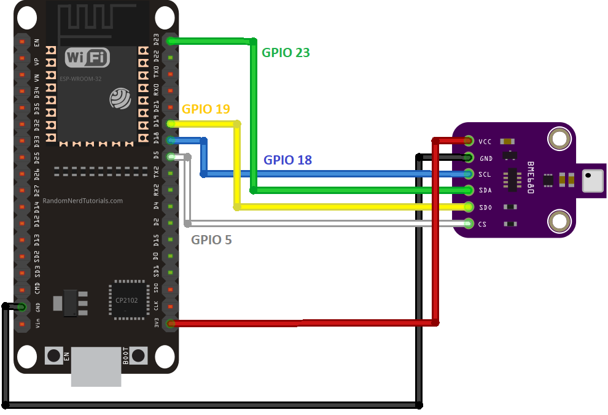
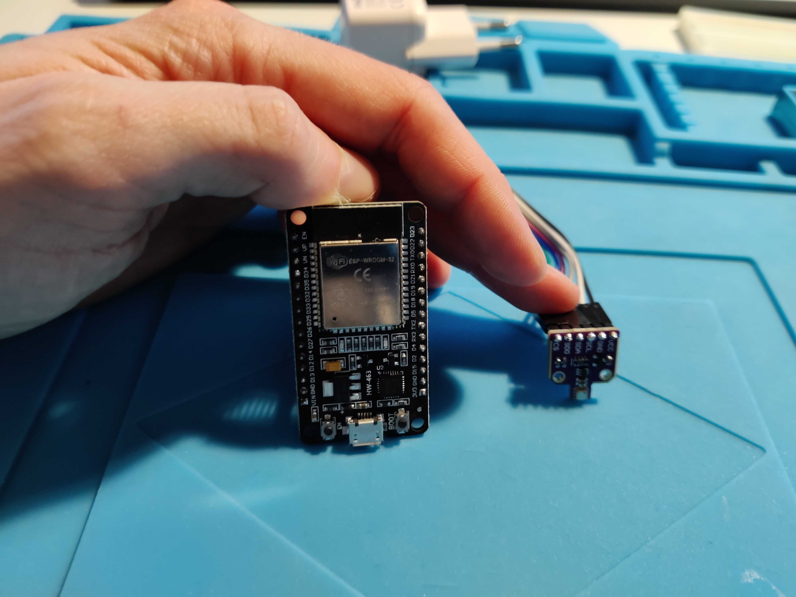
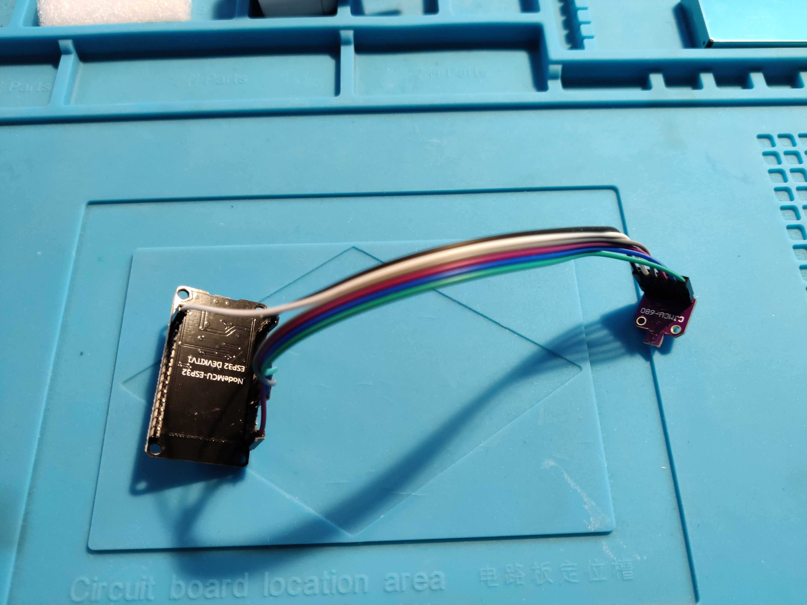

# Environment monitoring system with notification system
Budget friendly and lower-power consumption environment monitoring system with ESP32 board, BME680 sensor and PM-G7.

## Overview

This guide is part of a project I built to monitor the air quality, temperature, humidity, pressure and gas in a closed room. 

It's built using an ESP32 board for its low power consumption and small size. 

I've paired this project with a notification system, you can configure different notifications based on my needs. It's placed in a room and notifies me when: 
- The air quality has deteriorated and I need to open a window to refresh the air
- The temperature is running high and I need to cool down with a fan
- The temperature is running low and I need to turn up the heaters
- The air quality is dangerous because of different levels of gas

I've also 3D printed a small case (PLA) to hold the pieces together.

Excluding time for build and development, the breakdown of the costs are as follows: 

- EUR 7.66 for the ESP32
- EUR 18.50 for the BME680 sensor
- EUR 19.99 for the PMS7003 sensor
- EUR 0.67 for the 8 magnets
- EUR 5 for the power supply (I used a micro-USB power supply I had already, I'm guessing you can get one for that price off Amazon)
- EUR 20 for the soldering iron
- EUR for the X grams of PLA
- EUR for the X kilowatts of energy to print the piece (X hours)

The total of this project comes down to round **EUR 80**

## Resources

- [ESP32 board by diymore ](https://www.amazon.fr/dp/B0BS6R68H6?psc=1&ref=ppx_yo2ov_dt_b_product_details)
- [BME680 sensor](https://www.amazon.fr/dp/B07K1CGQTJ?psc=1&ref=ppx_yo2ov_dt_b_product_details)
- [PM-G7 sensor](https://www.amazon.fr/dp/B0B1526JHQ?psc=1&ref=ppx_yo2ov_dt_b_product_details)
- X Jumper cables (female to female)
- PLA + (I have a personal preference for SUNLU PLA +, but you can use any kind of PLA)
- [5x3mm magnets for the case](https://www.amazon.fr/dp/B0C9WQYZ27?ref=ppx_yo2ov_dt_b_product_details&th=1)
- Some strong glue to stick the magnets to the case
- A soldering iron and relevant materials

## 3D prints

The parts were printed using a Creality CR-20 pro. 

The pieces are as follows: 

The print times are as follows: 

My slicer settings were as follows: 

## Assembly and wiring

1. First, solder the pins to the BME680 if they weren't soldered together in the first place. I used a breadboard and jumper cable to keep it aligned during the soldering. 

2. Next we wire the BME680 sensor to the ESP32, using the SPI connection

## Software setup

I'm assuming you are familiar with the ESP32 micro-controller and now how to access and run it. There are loads of guides to get started, you can use these for reference: 
- https://randomnerdtutorials.com/getting-started-with-esp32/
- https://www.youtube.com/watch?v=tc3Qnf79Ny8

- Setup a new project using PlatformIO
- Install the ESP32 Boardard Adafruit BME680 Library (The latest version I installed was 2.0.4)
- Install the PMserial library by Alvaro Valdebenito (the latest version I installed was 1.2.0)
- Upload the code using platformIO. If your board is like mine, **press boot when the terminal shows "connecting...."**

## Software explanations

I've included comments inside the code for additional explanations.

The code does the following on a loop: 

1. Initialise the pins
2. Turn on the LED
3. Gather the data through the BME680 sensor
4. Turn the LED off
5. Sleep

### Bonus: ESPHome for HomeAssistant

I followed [this guide](https://www.youtube.com/watch?v=7PoUWszwaFk) to setup ESPHome on the ESP32. 

The official ESPHome page is available [here](https://esphome.io/guides/getting_started_hassio).

I'm assuming you already have Home Assistant installed. 

1. Install ESPHome add-on (hopefully you have Home Assistant OS and not a docker install, it's much easier - just click the "Show Add-on on My" to install the add-on)
2. 

## Final comments

I used different online guides to get to the final results. You'll find some references below.

- [BME Sensor SPI setup](https://randomnerdtutorials.com/esp32-bme680-sensor-arduino/)
- https://www.pieterbrinkman.com/2021/02/03/build-a-cheap-air-quality-meter-using-esphome-home-assistant-and-a-particulate-matter-sensor/

## Future improvements

- Make it more portable by using a portable battery
- I would have liked to add an OLED display but was limited by the number of power GPIOs