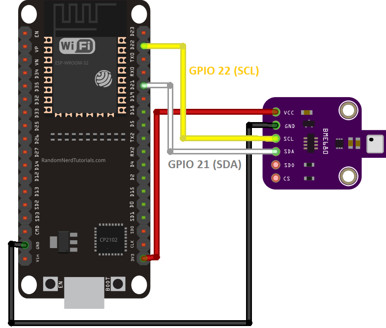
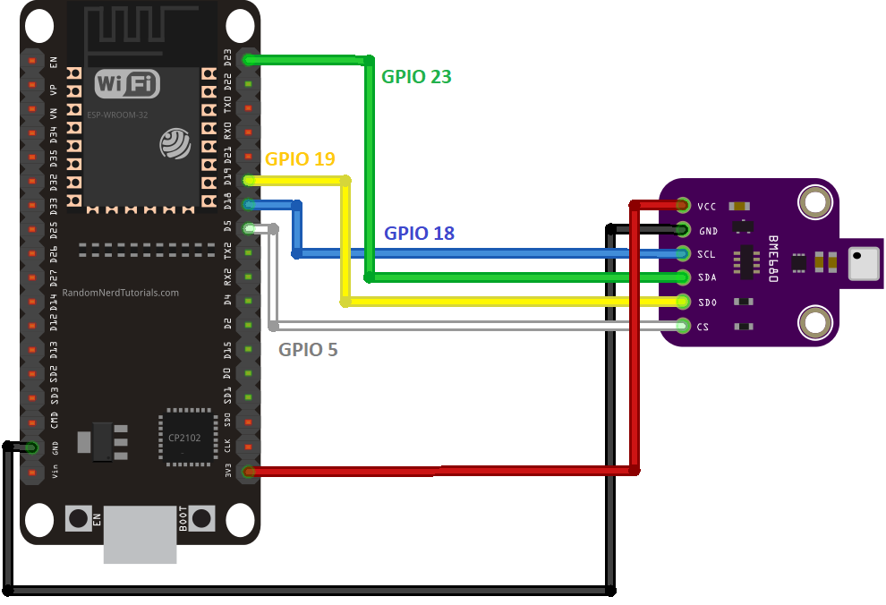

# Environment monitoring system with notification system
Budget friendly and lower-power consumption environment monitoring system with ESP32 board, BME680 sensor and PM-G7.

## Overview

This guide is part of a project I built to monitor the air quality, temperature, humidity, pressure and gas in a closed room. 

It's built using an ESP32 board for its low power consumption and small size. 

I've paired this project with a notification system, you can configure different notifications based on my needs. It's placed in a room and notifies me when: 
- The air quality has deteriorated and I need to open a window to refresh the air
- The temperature is running high and I need to cool down with a fan
- The temperature is running low and I need to turn up the heaters
- The air quality is dangerous because of different levels of gas

I've also 3D printed a small case (PLA) to hold the pieces together.

Excluding time for build and development, the breakdown of the costs are as follows: 

- EUR 7.66 for the ESP32
- EUR 18.50 for the BME680 sensor
- EUR 19.99 for the PMS7003 sensor
- EUR 1.95 PMS7003 sensor adapter
- EUR 0.67 for the 8 magnets
- EUR 5 for the power supply (I used a micro-USB power supply I had already, I'm guessing you can get one for that price off Amazon)
- EUR 20 for the soldering iron
- EUR 0.89 for the 89 grams of PLA (approx)

The total of this project comes down to round **EUR 80**

I used platformIO to manage the ESP32, the main folder with the content is available in the folder "ESP32 ENVIRONMENT MONITORING SYSTEM"

## Resources

- [ESP32 board by diymore ](https://www.amazon.fr/dp/B0BS6R68H6?psc=1&ref=ppx_yo2ov_dt_b_product_details)
- [BME680 sensor](https://www.amazon.fr/dp/B07K1CGQTJ?psc=1&ref=ppx_yo2ov_dt_b_product_details)
- [PM-G7 / PMSA7003 sensor](https://www.amazon.fr/dp/B0B1526JHQ?psc=1&ref=ppx_yo2ov_dt_b_product_details)
- [PMS7003 sensor adapter](https://soldered.com/product/pms7003-sensor-adapter/)
- 8 Jumper cables (female to female)
- PLA + (I have a personal preference for SUNLU PLA +, but you can use any kind of PLA)
- [5x3mm magnets for the case](https://www.amazon.fr/dp/B0C9WQYZ27?ref=ppx_yo2ov_dt_b_product_details&th=1)
- Some strong glue to stick the magnets to the case
- A soldering iron and relevant materials


## 3D prints

The parts were printed using a Creality CR-20 pro. 

The pieces are as follows: 
- Lid
- Case

There are two versions of the lid. For some reason, I could not print the first version with the hex holes, so I created the second version which should provide a lot more air to the sensors but is less beautiful and is not suitable for exterior use. 

The print times totals to 9h and 13 minutes. 

My slicer settings were as follows: 

- Infill: 20%
- Infill pattern: Gyroid
- Support: Touching build plate
- Support pattern: lines
- Nozzle size: 0.4mm
- Nozzle temp: 210 degrees
- Bed temp: 60 degrees

## Assembly and wiring


1. First, solder the pins to the BME680 if they weren't soldered together in the first place. I used a breadboard and jumper cable to keep it aligned during the soldering. 


2. Next we wire the BME680 sensor to the ESP32, using the I2C connection



Optionally, you can use the SPI connection (however it won't work with home assistant add-on, I2C is required).



3. Next we will connect the PMS7003. If you are lucky, you go one with an adaptor board to make the assembly. I didn't and had to solder the pins myself. The connections are shown below.


Beware: the pins are very fragile and close together, I highly recommend you use an adapter board instead.

## Software setup

I'm assuming you are familiar with the ESP32 micro-controller and now how to access and run it. There are loads of guides to get started, you can use these for reference: 
- https://randomnerdtutorials.com/getting-started-with-esp32/
- https://www.youtube.com/watch?v=tc3Qnf79Ny8


- Setup a new project using PlatformIO
- Install the ESP32 Boardard Adafruit BME680 Library (The latest version I installed was 2.0.4)
- Install the PMserial library by Alvaro Valdebenito (the latest version I installed was 1.2.0)
- Upload the code using platformIO. If your board is like mine, **press boot when the terminal shows "connecting...."**

## Software explanations

I've included comments inside the code for additional explanations.

The code does the following on a loop: 

1. Initialise the pins
2. Turn on the LED
3. Gather the data through the BME680 sensor
4. Turn the LED off
5. Sleep

### Bonus: ESPHome for HomeAssistant

Using ESPHome will not work in combination with the code provided. Any actions you take will remove any work done through platformIO.

Installing ESPHome will remove the need for the code provided and the use of PlatformIO. You will have access to the sensors directly from HA. 

I followed [this guide](https://www.youtube.com/watch?v=7PoUWszwaFk) to setup ESPHome on the ESP32. 

The official ESPHome page is available [here](https://esphome.io/guides/getting_started_hassio).

I'm assuming you already have Home Assistant installed. 


1. Make sure you are running the latest version of Home Assistant Core and Home Assistant OS, upgrade if necessary. I am running version 2024.3.1 of HA Core and version 12.1 of HA OS. 
2. Install ESPHome add-on with all the toggles activated (hopefully you have Home Assistant OS and not a docker install, it's much easier - just click the "Show Add-on on My" to install the add-on)
3. Install ESPHome on the ESP32, a useful guide can be found [here](https://www.youtube.com/watch?v=mCs0fa7Gr9U) or [this one](https://www.youtube.com/watch?v=7PoUWszwaFk). I used "OpenESPHomeWeb" to install ESPHome on the ESP32 board (this was the easiest method I found)
4. Add this [BME680 add-on](https://esphome.io/components/sensor/bme680) to your ESP32 configuration:
   ```
    i2c: 
        # Example configuration entry
        sensor:
        - platform: bme680
            temperature:
            name: "BME680 Temperature"
            oversampling: 16x
            pressure:
            name: "BME680 Pressure"
            humidity:
            id: "humidity"
            name: "BME680 Humidity"
            gas_resistance:
            id: "gas_resistance"
            name: "BME680 Gas Resistance"
            address: 0x77
            update_interval: 30s
        - platform: template
            name: "BME680 Indoor Air Quality"
            id: iaq
            icon: "mdi:gauge"
            # calculation: comp_gas = log(R_gas[ohm]) + 0.04 log(Ohm)/%rh * hum[%rh]
            lambda: |-
            return log(id(gas_resistance).state) + 0.04 *  id(humidity).state;
        text_sensor:
        - platform: template
            name: "BME680 IAQ Classification"
            icon: "mdi:checkbox-marked-circle-outline"
            lambda: |-
            if (int(id(iaq).state) <= 50) {
                return {"Excellent"};
            }
            else if (int(id(iaq).state) <= 100) {
                return {"Good"};
            }
            else if (int(id(iaq).state) <= 150) {
                return {"Lightly polluted"};
            }
            else if (int(id(iaq).state) <= 200) {
                return {"Moderately polluted"};
            }
            else if (int(id(iaq).state) <= 250) {
                return {"Heavily polluted"};
            }
            else if (int(id(iaq).state) <= 350) {
                return {"Severely polluted"};
            }
            else if (int(id(iaq).state) <= 500) {
                return {"Extremely polluted"};
            }
            else {
                return {"unknown"};
            }
   ```
5. Add this [PMSX003 add-on](https://esphome.io/components/sensor/pmsx003) to your ESP32 configuration

Before the i2c variable: 

```
uart:
  rx_pin: GPIO3
  tx_pin: GPIO1
  baud_rate: 9600
```

You cannot have two "sensor" variables, please add another sensor element: 

```
sensor:
  - platform: pmsx003
    type: PMSX003
    pm_1_0:
      name: "Particulate Matter <1.0µm Concentration"
    pm_2_5:
      name: "Particulate Matter <2.5µm Concentration"
    pm_10_0:
      name: "Particulate Matter <10.0µm Concentration"
    update_interval: 30s
```

The final result should look something like this: 

```
XXX
```

1. (optional) Add automations in home assistant to send notifications


And you're done! You should be able to add the sensor information to your dashboard. Refer to the documentation for additional configuration.


## Final comments

I used different online guides to get to the final results. You'll find some references below.

- [BME Sensor SPI setup](https://randomnerdtutorials.com/esp32-bme680-sensor-arduino/)
- https://www.pieterbrinkman.com/2021/02/03/build-a-cheap-air-quality-meter-using-esphome-home-assistant-and-a-particulate-matter-sensor/


## Future improvements

- Improve the connections with the PMS7003 sensor by using an adapter board, it would make the connections less fragile and easier to setup
- Make it more portable by using a portable battery
- I would have liked to add an OLED display but was limited by the number of power GPIOs
- A server can be added to display the results on a web page and additional notifications