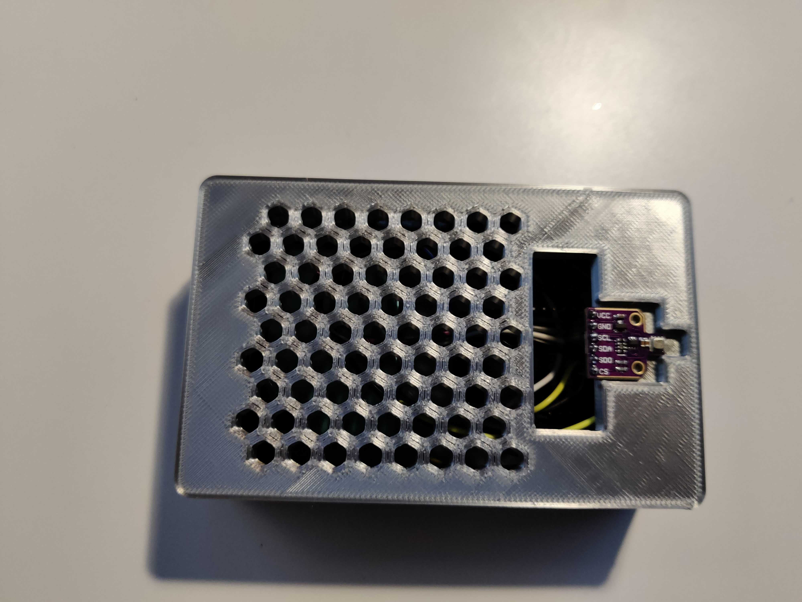
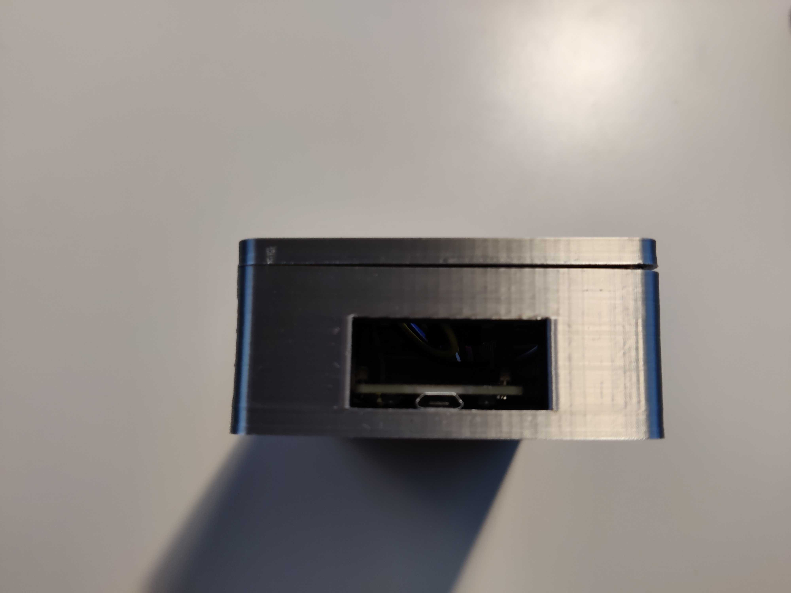
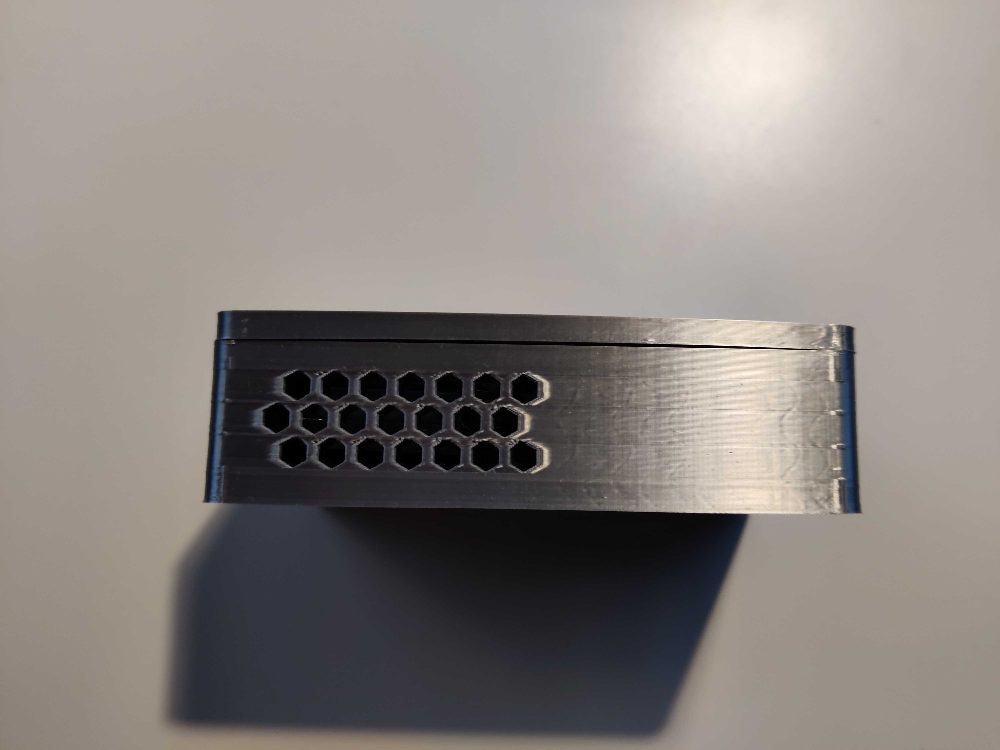
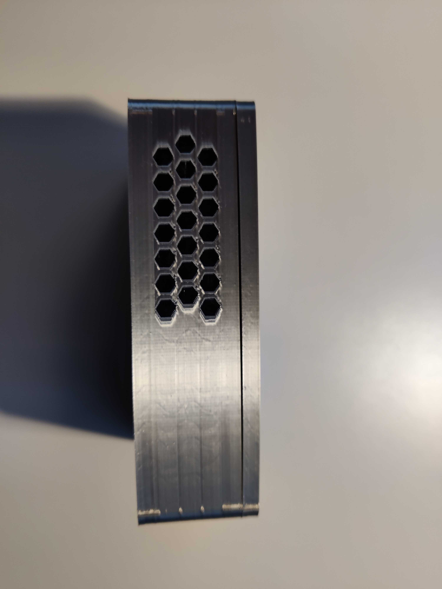
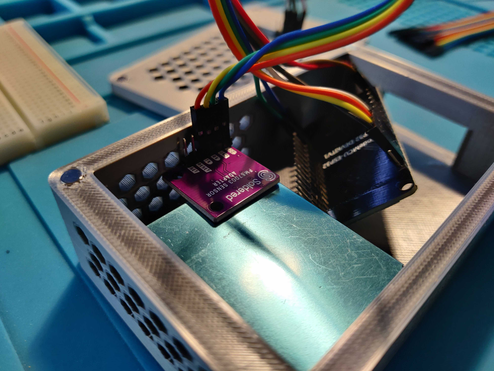
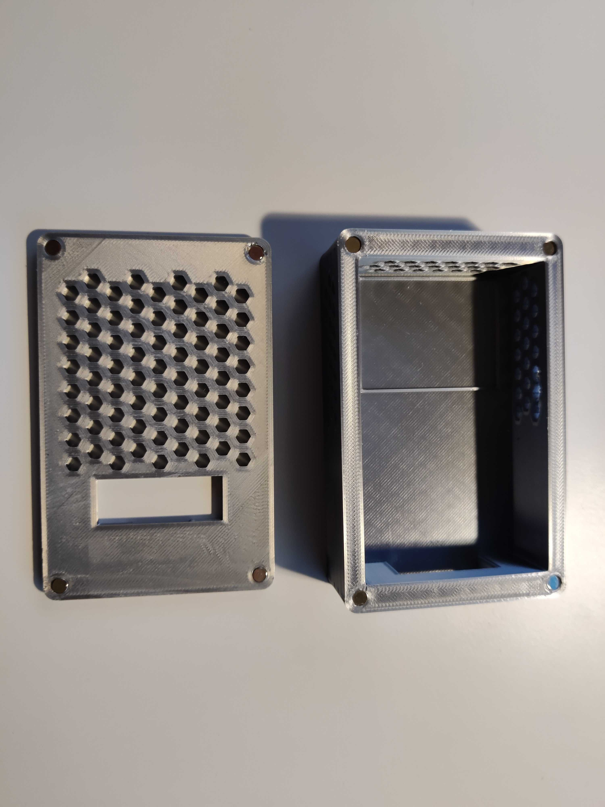
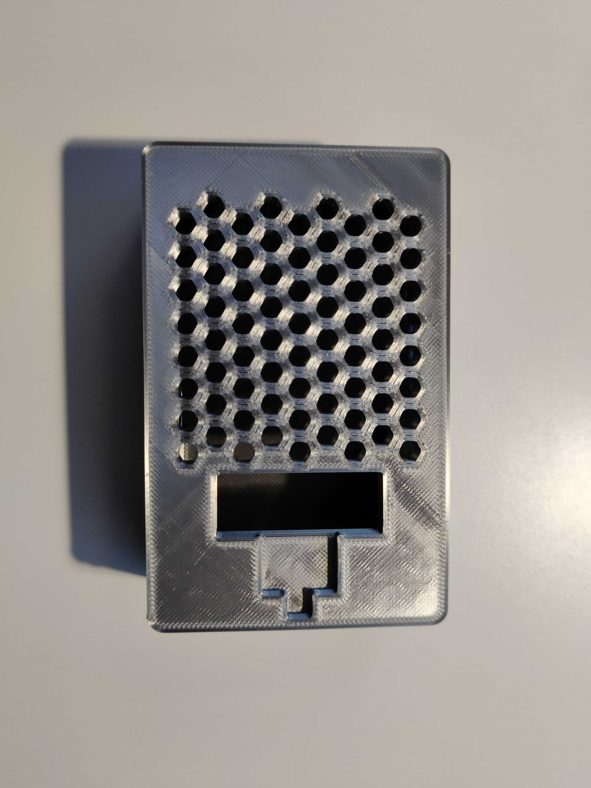
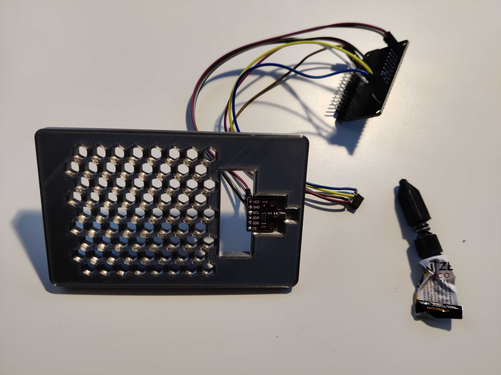
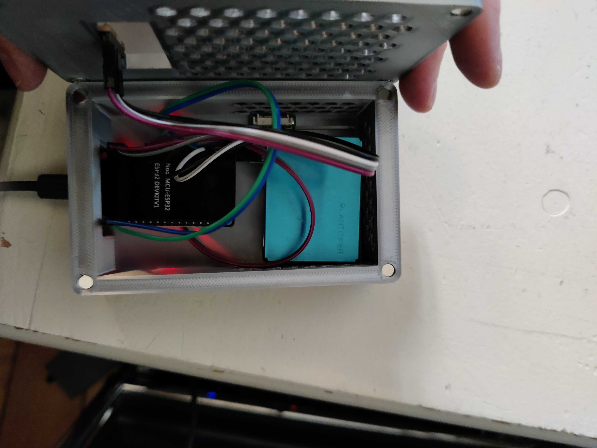

# Environment monitoring system and simple web server
Budget friendly and lower-power consumption environment monitoring system with ESP32 board, BME680 sensor and PM-G7.






## Overview

This guide is part of a project I built to monitor the air quality, temperature, humidity, pressure and gas in a closed room. 

It's built using an ESP32 board for its low power consumption and small size. 

I've paired this project with a notification system (only for HA), you can configure different notifications based on my needs. It's placed in a room and notifies me when: 
- The air quality has deteriorated and I need to open a window to refresh the air
- The temperature is running high and I need to cool down with a fan
- The temperature is running low and I need to turn up the heaters
- The air quality is dangerous because of different levels of gas
- The air quality based on the PMS sensor data

I've also 3D printed a small case (PLA) to hold the pieces together.

Excluding time for build and development, the breakdown of the costs are as follows: 

- EUR 7.66 for the ESP32
- EUR 18.50 for the BME680 sensor
- EUR 19.99 for the PMS7003 sensor
- EUR 1.95 PMS7003 sensor adapter
- EUR 0.67 for the 8 magnets
- EUR 5 for the power supply (I used a micro-USB power supply I had already, I'm guessing you can get one for that price off Amazon)
- EUR 20 for the soldering iron
- EUR 0.69 for the 69 grams of PLA (approx)
- 
The total of this project comes down to round **EUR 80**.

I used platformIO to manage the ESP32, the main folder with the content is available in the folder "ESP32 ENVIRONMENT MONITORING SYSTEM"

## Resources

- [ESP32 board by diymore ](https://www.amazon.fr/dp/B0BS6R68H6?psc=1&ref=ppx_yo2ov_dt_b_product_details)
- [BME680 sensor](https://www.amazon.fr/dp/B07K1CGQTJ?psc=1&ref=ppx_yo2ov_dt_b_product_details)
- [PM-G7 / PMSA7003 sensor](https://www.amazon.fr/dp/B0B1526JHQ?psc=1&ref=ppx_yo2ov_dt_b_product_details)
- [PMS7003 sensor adapter](https://soldered.com/product/pms7003-sensor-adapter/)
- 8 Jumper cables (female to female)
- PLA + (I have a personal preference for SUNLU PLA +, but you can use any kind of PLA)
- [5x3mm magnets for the case](https://www.amazon.fr/dp/B0C9WQYZ27?ref=ppx_yo2ov_dt_b_product_details&th=1)
- A soldering iron and relevant materials
- Superglue to glue the BME680 sensor to the case


## 3D prints

The parts were printed using a Creality CR-20 pro. 

The pieces are as follows: 
- Lid (v3) 
- Case (v2) (or case_soldered)

The original version of the case had some issues: 
- there was not enough space to attach the jumper cables to the BME680 sensor
- the stands for the ESP32 were way too far (the reference model I used was incorrect) and the stand weren't solid enough
- the whole for the charging port of the ESP32 was a little too low
- the depth of the magnets could be improved by 1mm to avoid any space between the lid and the case

Overall it should work if you print it but you'll need to find a way to connect the BME680 sensor, remove the stands. You could glue everything together with hot glue to avoid any issues with the charging port of the ESP32. 

I wanted to improve the design in general and fix the above issues, you'll find the second version of the case is much better overall. 

There are three versions of the lid. For some reason, I could not print the first version with the hex holes, so I created the second version which should provide a lot more air to the sensors but is less beautiful and is not suitable for exterior use. 

The third version is cleaned up to fit my needs with enough air, with a better design, rounded corners and a thinner format.

The print times totals to 8h and 34 minutes. 

*If you are using the soldered adapter* I made improvements to the case, as the previous versions didn't leave enough space for the jumper cables (see image below). I took the opportunity to remove the space for the PMS7003 which wasn't fit for purpose (see comment above).



You'll have to flip the lid 180 degrees, with the holes facing outward. This will make it easier to remove the supports for the BME680 sensor holder rather than the holes. 

My slicer settings were as follows: 

- Infill: 10%
- Infill pattern: Gyroid
- Support: Touching build plate
- Support pattern: lines
- Nozzle size: 0.4mm
- Nozzle temp: 210 degrees
- Bed temp: 60 degrees
- Print speed: 80 mm/s
- Infill speed" 40 mm/s
- Travel speed 200 mm/s
- Initial layer speed: 20 mm/s
- Support: everywhere at 80 degrees angle
- **Remove overlapping volumes in Mesh fixes settings in order to print honeycomb holes on lid**

## Assembly and wiring


1. First, solder the pins to the BME680 if they weren't soldered together in the first place. I used a breadboard and jumper cable to keep it aligned during the soldering. 


2. Next we wire the BME680 sensor to the ESP32, using the I2C connection


Optionally, you can use the SPI connection (however it won't work with home assistant add-on, I2C is required).


3. Next we will connect the PMS7003. If you are lucky, you go one with an adaptor board to make the assembly. I originally didn't and had to solder the pins myself (bad idea). After buying an adapter, I followed the connections below. The connection are pretty self explanatory.

For HA: <br />
RX -> TX0 <br />
TX -> RX0 <br />
For the version of the software without HA:<br />
RX -> TX2 <br />
TX -> RX2 <br />
VCC -> VIN <br />
GND -> GND <br />


1. Install the magnets in place. The holes might seem a little too tight but if you slowly push in the magnets they will fit perfectly into place (using a flat surface like a hammer helps). Make sure the polarity is correct (you want to close the lid on the case!)



5. Glue the BME680 sensor to the case (base of the component)




6. Place the components inside



7. (optional) glue with hot glue the ESP32 in place (depending on the length of your jumper cables it might not be an issue but because there is no holder you'll have to open the lid every time you plug/unplug the ESP32)

8. close the lid and you're ready to go !

## Software setup

I'm assuming you are familiar with the ESP32 micro-controller and now how to access and run it. There are loads of guides to get started, you can use these for reference: 
- https://randomnerdtutorials.com/getting-started-with-esp32/
- https://www.youtube.com/watch?v=tc3Qnf79Ny8


- Setup a new project using PlatformIO
- Install the ESP32 Boardard Adafruit BME680 Library (The latest version I installed was 2.0.4)
- Install the PMserial library by Alvaro Valdebenito (the latest version I installed was 1.2.0)
- Install ESPAsyncWebServer-esphome library (the latest version I installed was 2.1.0)
- Install the AsyncTCP-esphome library (the latest version I installed was 1.2.2)
- Upload the code using platformIO. If your board is like mine, **press boot when the terminal shows "connecting...."**

*Notes*:
- Don't forget to specify `build_flags = -D PMS_RX=16 -D PMS_TX=17` in platformio.ini or your execution will fail and you will get an error during BME680 initialisation (although these flags are required for the PMS7003)
- Plugging the PMS7003 on the RX0 and TX0 pins results in errors entering the bootloader and makes updated impossible.

## Software explanations

I've included comments inside the code for additional explanations. You can un-comment certain lines to enable console logging.

The code does the following on a loop: 

1. Initialise the pins
2. Initialise the sensors (BME680 and PMS7003)
3. Initialise the server
4. Turn on the LED
5. Gather the data through the BME680 sensor
6. Update the global values
7. Display the values on the web page
8. Turn the LED off
9. Sleep


The `setup()` function initialises the BME680, server with the STA connection, sampling for the sensor and pin for the LED.

The `loop()` function handles the led on/off, BME680 readings and sending the sensor data back to the server. 

The `processor()` function handles the update of the variables inside the `index_html` variable.

The `notFound()` function simply sends a 404 response if the page is not found.


## Usage

To connect to the server, simply visit inside a web browser the IP of the ESP32 (displayed inside the serial console).

## Environment variable handling

https://stackoverflow.com/questions/62314497/access-of-outer-environment-variable-in-platformio

### Bonus: ESPHome for HomeAssistant (only for the first configuration)

Using ESPHome will not work in combination with the code provided. Any actions you take will remove any work done through platformIO.

Installing ESPHome will remove the need for the code provided and the use of PlatformIO. You will have access to the sensors directly from HA. 

I followed [this guide](https://www.youtube.com/watch?v=7PoUWszwaFk) to setup ESPHome on the ESP32. 

The official ESPHome page is available [here](https://esphome.io/guides/getting_started_hassio).

I'm assuming you already have Home Assistant installed. 


1. Make sure you are running the latest version of Home Assistant Core and Home Assistant OS, upgrade if necessary. I am running version 2024.3.1 of HA Core and version 12.1 of HA OS. 
2. Install ESPHome add-on with all the toggles activated (hopefully you have Home Assistant OS and not a docker install, it's much easier - just click the "Show Add-on on My" to install the add-on)
3. Install ESPHome on the ESP32, a useful guide can be found [here](https://www.youtube.com/watch?v=mCs0fa7Gr9U) or [this one](https://www.youtube.com/watch?v=7PoUWszwaFk). I used "OpenESPHomeWeb" to install ESPHome on the ESP32 board (this was the easiest method I found)
4. Add this [BME680 add-on](https://esphome.io/components/sensor/bme680) to your ESP32 configuration:
   ```
    i2c: 
        # Example configuration entry
        sensor:
        - platform: bme680
            temperature:
            name: "BME680 Temperature"
            oversampling: 16x
            pressure:
            name: "BME680 Pressure"
            humidity:
            id: "humidity"
            name: "BME680 Humidity"
            gas_resistance:
            id: "gas_resistance"
            name: "BME680 Gas Resistance"
            address: 0x77
            update_interval: 30s
        - platform: template
            name: "BME680 Indoor Air Quality"
            id: iaq
            icon: "mdi:gauge"
            # calculation: comp_gas = log(R_gas[ohm]) + 0.04 log(Ohm)/%rh * hum[%rh]
            lambda: |-
            return log(id(gas_resistance).state) + 0.04 *  id(humidity).state;
        text_sensor:
        - platform: template
            name: "BME680 IAQ Classification"
            icon: "mdi:checkbox-marked-circle-outline"
            lambda: |-
            if (int(id(iaq).state) <= 50) {
                return {"Excellent"};
            }
            else if (int(id(iaq).state) <= 100) {
                return {"Good"};
            }
            else if (int(id(iaq).state) <= 150) {
                return {"Lightly polluted"};
            }
            else if (int(id(iaq).state) <= 200) {
                return {"Moderately polluted"};
            }
            else if (int(id(iaq).state) <= 250) {
                return {"Heavily polluted"};
            }
            else if (int(id(iaq).state) <= 350) {
                return {"Severely polluted"};
            }
            else if (int(id(iaq).state) <= 500) {
                return {"Extremely polluted"};
            }
            else {
                return {"unknown"};
            }
   ```
5. Add this [PMSX003 add-on](https://esphome.io/components/sensor/pmsx003) to your ESP32 configuration

Before the i2c variable: 

```
uart:
  rx_pin: RX
  tx_pin: TX
  baud_rate: 9600
```

You cannot have two "sensor" variables, please add another sensor element: 

```
sensor:
  - platform: pmsx003
    type: PMSX003
    pm_1_0:
      name: "Particulate Matter <1.0µm Concentration"
    pm_2_5:
      name: "Particulate Matter <2.5µm Concentration"
    pm_10_0:
      name: "Particulate Matter <10.0µm Concentration"
    update_interval: 30s
```

The final result should look something like this: 

```
substitutions:
  name: esphome-web-f34cc0
  friendly_name: ESP32 Environment Sensors

esphome:
  name: ${name}
  friendly_name: ${friendly_name}
  name_add_mac_suffix: false
  project:
    name: esphome.web
    version: '1.0'

esp32:
  board: esp32dev
  framework:
    type: arduino

# Enable logging
logger:

# Enable Home Assistant API
api:

# Allow Over-The-Air updates
ota:

# Allow provisioning Wi-Fi via serial
improv_serial:

wifi:
  # Set up a wifi access point
  ap: {}

# In combination with the `ap` this allows the user
# to provision wifi credentials to the device via WiFi AP.
captive_portal:

dashboard_import:
  package_import_url: github://esphome/example-configs/esphome-web/esp32.yaml@main
  import_full_config: true

# Sets up Bluetooth LE (Only on ESP32) to allow the user
# to provision wifi credentials to the device.
esp32_improv:
  authorizer: none

# To have a "next url" for improv serial
web_server:

uart:
  rx_pin: RX
  tx_pin: TX
  baud_rate: 9600

i2c:
  # Example configuration entry
sensor:
  - platform: bme680
    temperature:
      name: "BME680 Temperature"
      oversampling: 16x
    pressure:
      name: "BME680 Pressure"
    humidity:
      id: "humidity"
      name: "BME680 Humidity"
    gas_resistance:
      id: "gas_resistance"
      name: "BME680 Gas Resistance"
    address: 0x77
    update_interval: 30s
  - platform: template
    name: "BME680 Indoor Air Quality"
    id: iaq
    icon: "mdi:gauge"
    # caulculation: comp_gas = log(R_gas[ohm]) + 0.04 log(Ohm)/%rh * hum[%rh]
    lambda: |-
      return log(id(gas_resistance).state) + 0.04 *  id(humidity).state;
  - platform: pmsx003
    type: PMSX003
    pm_1_0:
      name: "Particulate Matter <1.0µm Concentration"
    pm_2_5:
      name: "Particulate Matter <2.5µm Concentration"
    pm_10_0:
      name: "Particulate Matter <10.0µm Concentration"
    update_interval: 120s
text_sensor:
  - platform: template
    name: "BME680 IAQ Classification"
    icon: "mdi:checkbox-marked-circle-outline"
    lambda: |-
      if (int(id(iaq).state) <= 50) {
        return {"Excellent"};
      }
      else if (int(id(iaq).state) <= 100) {
        return {"Good"};
      }
      else if (int(id(iaq).state) <= 150) {
        return {"Lightly polluted"};
      }
      else if (int(id(iaq).state) <= 200) {
        return {"Moderately polluted"};
      }
      else if (int(id(iaq).state) <= 250) {
        return {"Heavily polluted"};
      }
      else if (int(id(iaq).state) <= 350) {
        return {"Severely polluted"};
      }
      else if (int(id(iaq).state) <= 500) {
        return {"Extremely polluted"};
      }
      else {
        return {"unknown"};
      }
```

1. (optional) Add automations in home assistant to send notifications


And you're done! You should be able to add the sensor information to your dashboard. Refer to the documentation for additional configuration.


## Final comments

I used different online guides to get to the final results. You'll find some references below.

- [BME Sensor SPI setup](https://randomnerdtutorials.com/esp32-bme680-sensor-arduino/)
- https://www.pieterbrinkman.com/2021/02/03/build-a-cheap-air-quality-meter-using-esphome-home-assistant-and-a-particulate-matter-sensor/


## Future improvements

- Add a placeholder for the ESP32, for the moment it has no holder. It's not moving much because of the length of the cables but it is not ideal. 
- I badly designed the holder for the PMS7003, assuming the breakout board would with inside but unfortunately the design needs to be improved to take account of the extra space needed.
- The size of the space for the pins of the BME680 is quite large and the placeholder for the BME680 as well. I built it as such so that you can also use other kinds of sensors (I'm planning on adding a soil sensor and humidity sensor), leaving enough space for jumper cables to go out of the case.
- Make it more portable by using a portable battery
- I would have liked to add an OLED display but was limited by the number of power GPIOs (an extension board is needed)

## Guides 

- https://randomnerdtutorials.com/esp32-bme680-sensor-arduino/
- https://github.com/avaldebe/PMserial
- https://www.espruino.com/PMS7003
- https://hpclab.blogspot.com/2020/02/esp8266-based-wifi-air-quality.html
- https://learn.adafruit.com/pm25-air-quality-sensor?view=all
- https://esphome.io/components/sensor/bme680
- https://esphome.io/components/sensor/pmsx003
- https://stackoverflow.com/questions/62314497/access-of-outer-environment-variable-in-platformio